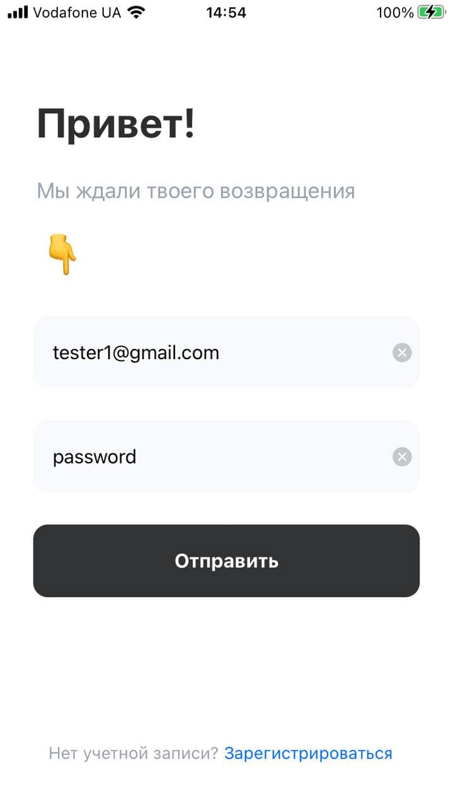
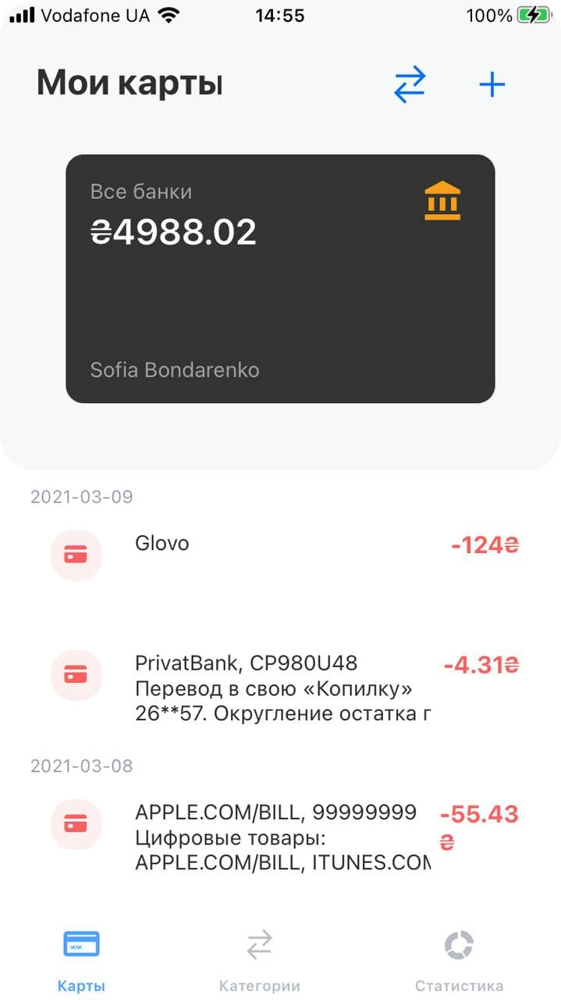
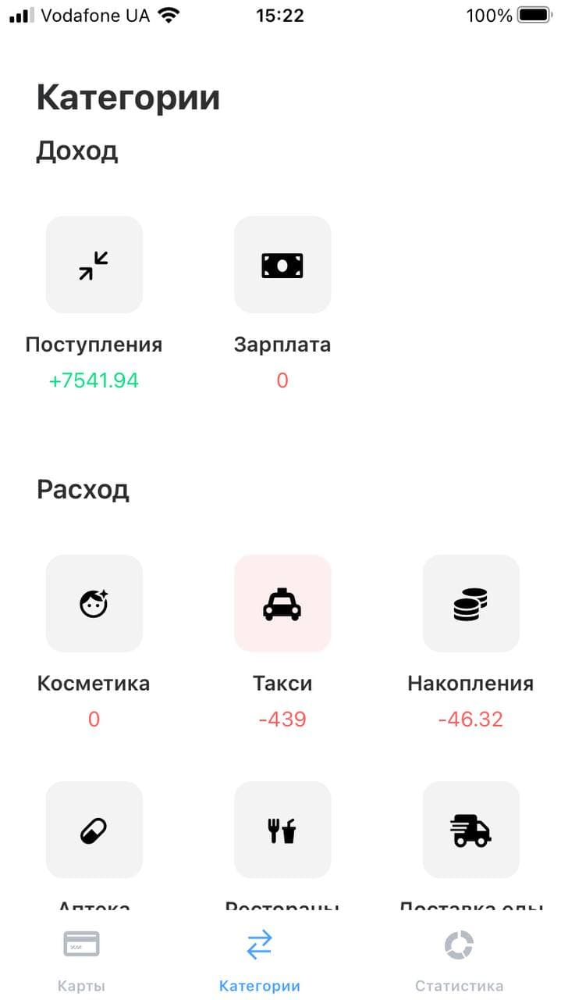
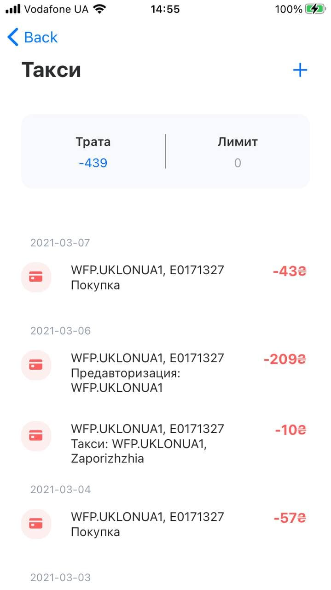
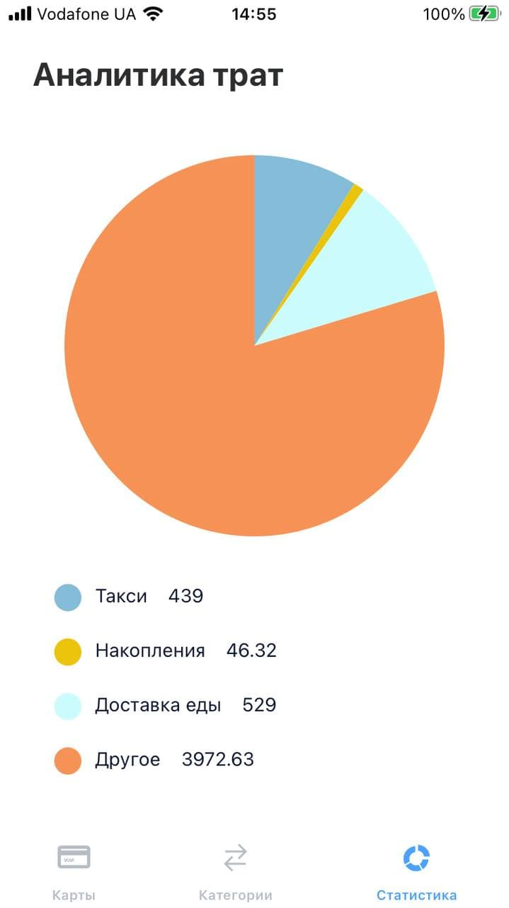
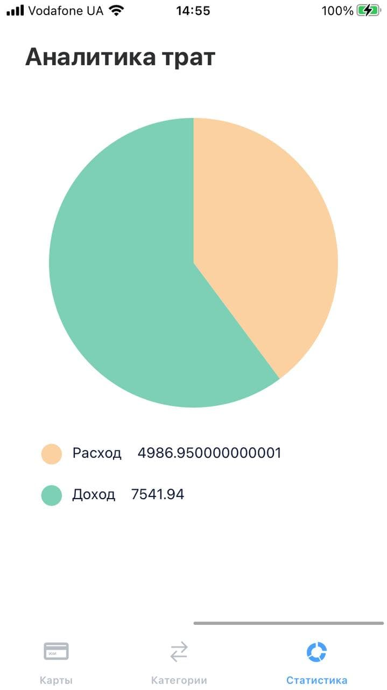
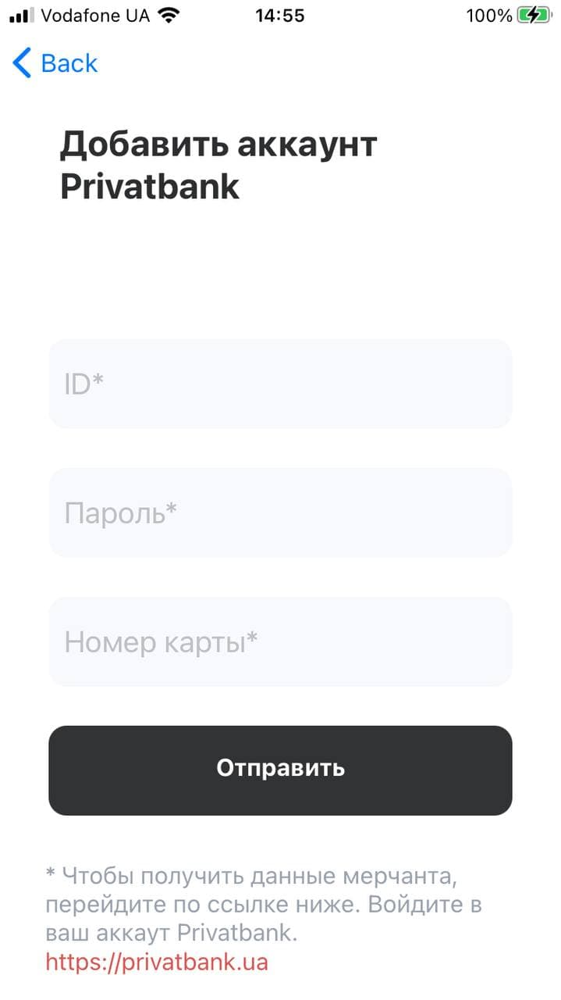
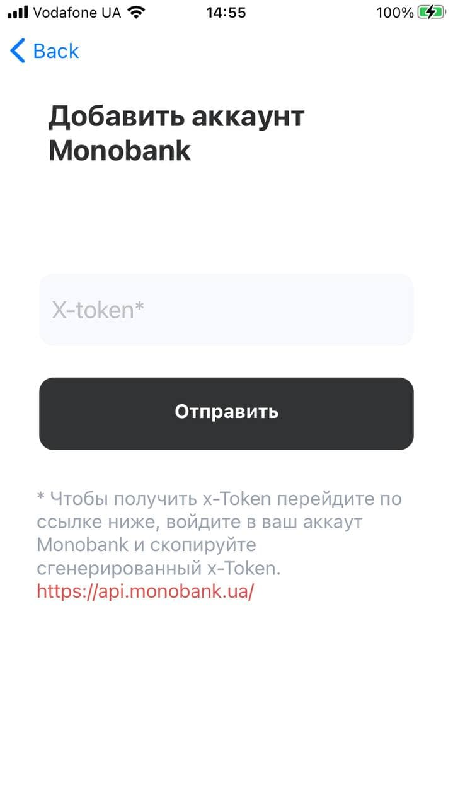

#Bank mobile react native application

A front-end module of Bank card chenking application. This module provides ui and connection to server on user-oriented endpoints;
allows performig following operations:
- connecting Privatbank and Monobank accounts to profile;
- cheking totall balance, discharges and income on all connected cards of user to this application;
- tracking discharges and income amounts on all provided categories by application;
- detalised analysys of each and every category activity;
- adding and changind spending limits on every category;
- graph visualization of income and expend amounts; of expend on each category amount
- sing in and sign up,

Here are screenshots of how this module works:

